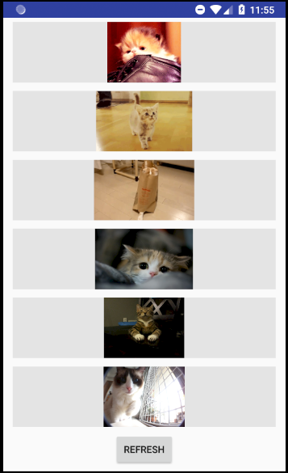
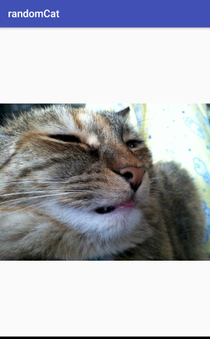

# TP_mobile
## Author : Dumortier Baptiste
A simple app to generate random cats pictures

## Consignes
- Le minimum :
  - Deux écrans : Un écran avec une liste et un écran avec un détail de l’item (Fait)
  - Appel WebService à une API Rest (Fait)
  - Stockage des données en cache (Pas de stockage nécessaire dans mon app)
- Les plus :
  - Architecture (MVC ou MVP ou MVVM) (Fait)
  - Gitflow (Non)
  - Animation entre écrans (Fait)
  - Notification push (En cours)
  - Autres fonctionnalités (En cours)
  
  ## Features :
  ### Home screen
  - A List of 10 cute cats pictures
  - You can touch one of these pictures to go the secondary screen
  
  
  - A refresh button
  
  
  ### Secondary screen
  - A bigger view of the cute cat
  
  - Animation when opening/closing the secondary screen
